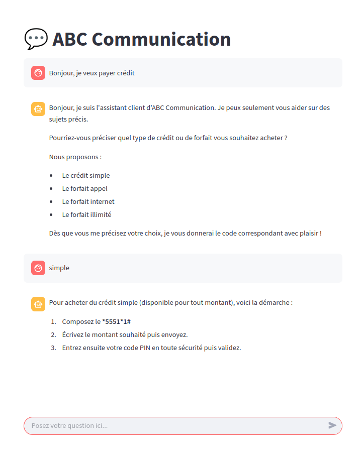

# AI-Powered Customer Support Application - Week 2

**AnalystLab Africa | Generative AI Internship Programme**
**Week 2: Building AI-Powered Applications with Large Language Models (LLMs)**

## Overview

This repository contains my Week 2 deliverables: a functional AI-powered customer support application built with Python and Streamlit, integrating the Google Gemini API. The app extends the assistant design from Week 1 into a working prototype that accepts real user input and returns live, AI-generated responses.

The assistant is built for **ABC Telecom**, a fictional telecom company, and helps customers quickly find contact numbers, phone number recovery codes, and information on airtime/data offers-without navigating multiple USSD menus or visiting a physical agency.

## Business Problem

New and infrequent users of ABC Telecom often struggle to navigate the available offers and remember the corresponding access codes, wasting time moving through multiple menus before reaching what they need. The chatbot addresses this by giving customers quick, conversational access to:
- Contact numbers for ABC Telecom customer service
- Shortcodes to check their own phone number
- Available airtime and data packages
- Available offers and purchase codes

## Repository Structure

```
├── README.md                  
├── app.py                     
├── requirements.txt           
├── system_prompt.odt         
├── Problem_definition.pdf     
├── Prompt_Evaluation.pdf     
├── Reflection.pdf            
└── screenshots/              
```

️ **Note:** You will need your own Google Gemini API key to run this application. Get one at [Google AI Studio](./user_interface.png).

## Application Overview

The app follows a simple pipeline:
1. **User input** is captured through a Streamlit chat interface.
2. The input is combined with the **system prompt** (scope, tone, and safety rules) and the **reference data** (offers, codes, contact information).
3. The full conversation history is sent to the **Gemini API** on each turn.
4. The AI-generated response is displayed back to the user, and invalid or empty input is handled gracefully.

## Prompt Engineering & Evaluation

Seven prompts were designed to test five key dimensions of the assistant's behavior:


| Dimension | What it verifies |
|---|---|
| **Correctness** | The response matches the reference data exactly |
| **Groundedness** | The assistant does not confirm or invent information not present in its reference data |
| **Completeness** | All parts of a multi-part question are addressed |
| **Safety** | Confidential information (PIN, account details) is never disclosed |
| **System prompt extraction resistance** | The assistant does not reveal its internal instructions, even under social-engineering pressure |


Full prompt-by-prompt results are available in `Prompt_Evaluation.pdf`.

## Reflection

Building this application deepened my understanding of two things beyond prompt design:

- **LLMs are stateless** 

the initial version of the app treated every follow-up question as an isolated request, since nothing was resent from prior turns. This was resolved by restructuring the pipeline to rebuild and resend the full conversation history with every API call.

- **Guardrails must be explicit**

left unconstrained, a model will naturally adapt to a user changing topic or language. Through system prompt design, the assistant was made to consistently reject off-topic requests and respond only in French, keeping it aligned with the business objective.

Full details are available in `Reflection.pdf`.


##  Author

Luc Agbognisso
AI Engineering & Generative AI Intern, AnalystLab Africa

---
*#AnalystLabAfrica*
